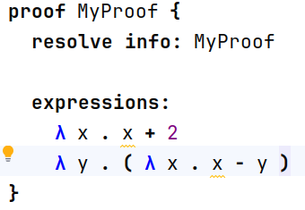

# Introduction
LambdaD: a starting point for implementing the LambdaD language as described in the book "Type Theory and Formal Proof" by Rob Nederpelt and Herman Geuvers.

# How to open:
- Download JetBrains MPS 2025.1 from https://www.jetbrains.com/mps/download/
- Clone this repo
- run `./gradlew setup` (Mac or Linux (ba)sh shell) or `gradlew.bat setup` (Windows cmd shell)
- Start JetBrains MPS and open this repo folder as an MPS project
